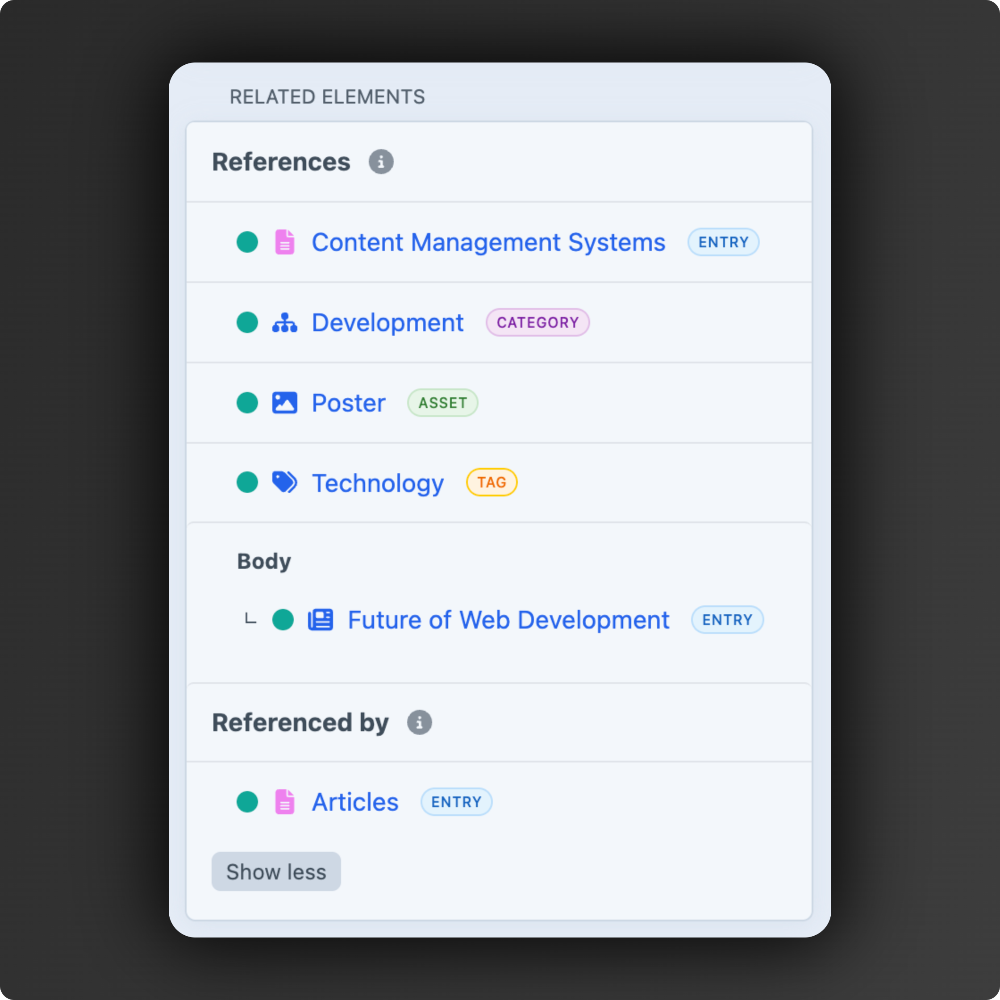

# Related Elements

Displays related elements of an entry, category or asset in the control panel edit view sidebar.



## Requirements

This plugin requires Craft CMS 5.0.0 or later, and PHP 8.2 or later.

## Installation

You can install this plugin from the Plugin Store or with Composer.

#### From the Plugin Store

Go to the Plugin Store in your project's Control Panel and search for "Related Elements". Then press "Install".

#### With Composer

Open your terminal and run the following commands:

```bash
# go to the project directory
cd /path/to/my-project.test

# tell Composer to load the plugin
composer require mindseeker-media/craft-related-elements

# tell Craft to install the plugin
./craft plugin/install related-elements
```

## Configuration

Configure options in the control panel under Settings → Related Elements or create a configuration file config/related-elements.php.

```php
<?php

return [
    'enableNestedElements' => true,
    'initialLimit' => 10,
    'showElementTypeLabel' => true,
];
```

### Settings

- **enableNestedElements** (boolean, default: `true`) - Whether to display the related elements that exist inside the CKEditor, Matrix or Neo fields of an element.
- **initialLimit** (integer, default: `10`) - Number of related elements to show initially before requiring "Show More" to expand the list.
- **showElementTypeLabel** (boolean, default: `true`) - Whether to display the element type labels (Entry, Category, Asset, Tag) next to each related element.
